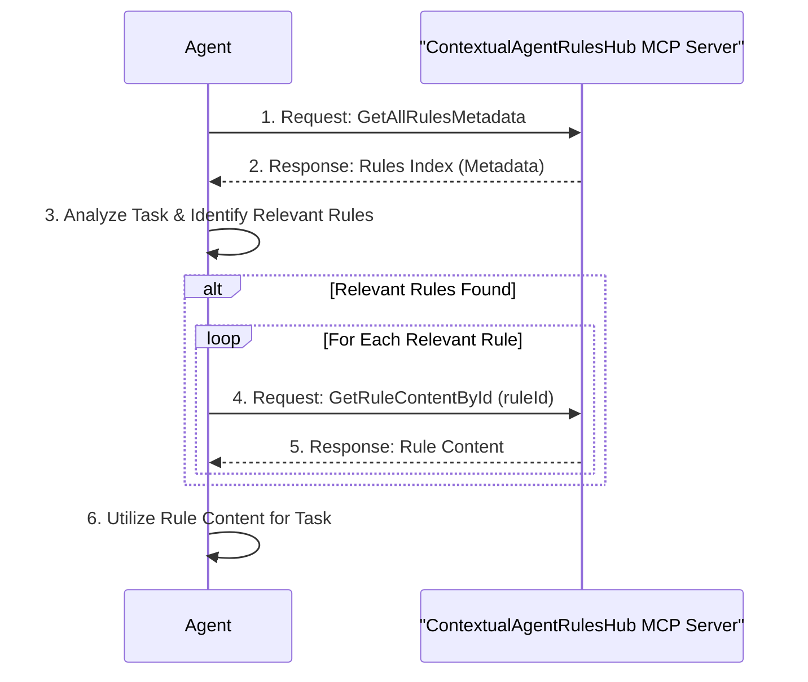

# Contextual Agent Rules Hub

## Overview

**ContextualAgentRulesHub is an MCP (Model Context Protocol) server** that provides a flexible system for storing and retrieving agent rules that can be used by AI agents to follow context-specific guidelines. The MCP server exposes tools for efficient rule discovery and content retrieval, enabling AI agents to access only the rules relevant to their current task.

## Motivation

Managing agent rules effectively can be challenging. Sharing rules across different agents or projects often leads to inconsistencies and difficulties in maintaining a centralized rule set. Furthermore, AI agents often operate with limited context windows. Sending a large, undifferentiated set of rules can consume valuable context space. ContextualAgentRulesHub aims to address these issues by:

-   Providing a structured way to organize and access rules.
-   Enabling agents to retrieve only the rules relevant to their current task, thus minimizing context length and improving efficiency.

## Task Flow

This section describes the typical flow of an AI agent interacting with the ContextualAgentRulesHub MCP server to retrieve and utilize rules for a given task.

1.  **Task Initiation**: An agent (e.g., Cline) begins a new task.
2.  **Retrieve Rule Index**: The agent queries the `rules-hub` MCP server using the `GetAllRulesMetadata` tool. This provides an index of all available rules, including their IDs, descriptions, languages, and tags.
3.  **Identify Relevant Rules**: Based on the current task's context (e.g., programming language, keywords, objectives) and the metadata received, the agent analyzes the rule index to identify which rules are relevant.
4.  **Retrieve Rule Content**: If relevant rules are identified, the agent uses the `GetRuleContentById` tool for each relevant rule ID to fetch its specific content.
5.  **Utilize Rules**: The agent incorporates the content of the retrieved rules to guide its actions, improve its output, or ensure adherence to specific guidelines for the task at hand.



## Features

- **Multi-Source Support**: Extensible architecture supporting File, Database, Git Repository, and API sources
- **YAML-Based Storage**: Human-readable rule storage with metadata and content separation
- **Efficient Indexing**: Fast lookups by language, tags, and content search
- **Lazy Loading**: Rule content is loaded only when needed for optimal performance
- **Flexible Querying**: Support for complex queries combining language, tags, and text search
- **Tag-Based Organization**: Flexible categorization system with AND/OR logic support

## Installation

1. **Clone the repository**:
   ```bash
   git clone <repository-url>
   cd ContextualAgentRulesHub
   ```

2. **Install dependencies**:
   ```bash
   pip install -r requirements.txt
   ```

## MCP Server Configuration

### Installation for MCP Usage

1. **Install Python dependencies**:
   ```bash
   pip install -r mcp-server/requirements.txt
   ```

2. **Configure your MCP client** (e.g., Claude Desktop, Cline):
   
   Add the following to your MCP settings file:
   
   **For Claude Desktop** (`claude_desktop_config.json`):
   ```json
   {
     "mcpServers": {
       "cotextual-agent-rules-hub": {
         "command": "python",
         "args": ["C:/path/to/ContextualAgentRulesHub/mcp-server/run_server.py"],
         "env": {
           "RulesLoaderOptions:0:SourceType": "YamlFile",
           "RulesLoaderOptions:0:Path": "C:/path/to/ContextualAgentRulesHub/rules"
         }
       }
     }
   }
   ```
   
   **For Cline VSCode Extension** (`settings.json`):
   ```json
   {
     "cline.mcpServers": {
       "cotextual-agent-rules-hub": {
         "command": "python",
         "args": ["C:/path/to/ContextualAgentRulesHub/mcp-server/run_server.py"]
       }
     }
   }
   ```

### Custom Instructions for MCP Client Configuration

As part of your MCP server configuration, you should add the following custom instruction block:

**"For each task use the cotextual-agent-rules-hub MCP server to get all rules metadata index and if there are rules relevant to the task read All of them them to the context - this is not optional"**

### Environment Configuration

The MCP server can be configured using environment variables:

| Variable | Description | Default |
|----------|-------------|---------|
| `RulesLoaderOptions:0:SourceType` | Source type for rules loading | `YamlFile` |
| `RulesLoaderOptions:0:Path` | Path to rules directory | `./rules` |
| `AGENT_RULES_VALIDATION` | Enable rule validation | `true` |
| `AGENT_RULES_LOG_LEVEL` | Logging level (DEBUG, INFO, WARNING, ERROR) | `INFO` |

#### Multiple Sources Configuration

You can configure multiple rule sources by using indexed environment variables. Add additional sources using `RulesLoaderOptions:1:`, `RulesLoaderOptions:2:`, etc.

**Example with multiple sources**:
```bash
# First source - Local YAML files
RulesLoaderOptions:0:SourceType=YamlFile
RulesLoaderOptions:0:Path=C:/path/to/ContextualAgentRulesHub/rules

# Second source - Additional rule directory
RulesLoaderOptions:1:SourceType=YamlFile
RulesLoaderOptions:1:Path=C:/path/to/additional/rules

# Third source - Team shared rules
RulesLoaderOptions:2:SourceType=YamlFile
RulesLoaderOptions:2:Path=\\shared\network\path\team-rules
```

**In MCP client configuration**:
```json
{
  "mcpServers": {
    "cotextual-agent-rules-hub": {
      "command": "python",
      "args": ["C:/path/to/ContextualAgentRulesHub/mcp-server/run_server.py"],
      "env": {
        "RulesLoaderOptions:0:SourceType": "YamlFile",
        "RulesLoaderOptions:0:Path": "C:/path/to/ContextualAgentRulesHub/rules",
        "RulesLoaderOptions:1:SourceType": "YamlFile",
        "RulesLoaderOptions:1:Path": "C:/path/to/additional/rules"
      }
    }
  }
}
```

### Available MCP Tools

The server exposes two main tools:

#### `GetAllRulesMetadata`
- **Purpose**: Retrieve metadata for all available rules
- **Parameters**: None
- **Returns**: JSON array of rule metadata objects
- **Usage**: Query this first to discover available rules

**Example Response**:
```json
[
  {
    "ruleId": "csharp-standards-rule",
    "description": "This rule checks for adherence to C# coding standards",
    "language": "csharp",
    "tags": ["coding-standards", "best-practices"],
    "source": {
      "sourceType": "File"
    }
  }
]
```

#### `GetRuleContentById`
- **Purpose**: Get the full content of a specific rule
- **Parameters**: 
  - `ruleId` (string): The unique identifier of the rule
- **Returns**: Rule content as markdown/text
- **Usage**: Retrieve specific rule content after identifying relevant rules

**Example Usage**:
```json
{
  "ruleId": "csharp-standards-rule"
}
```

### Testing the MCP Server

#### Manual Testing

1. **Start the server directly**:
   ```bash
   cd ContextualAgentRulesHub
   python mcp-server/run_server.py
   ```

2. **Test with included script**:
   ```bash
   python test_mcp_server.py
   ```

#### Integration Testing

1. **Configure your MCP client** with the server settings above
2. **Query available rules**:
   - Use the `GetAllRulesMetadata` tool to see all available rules
   - Verify that rules are loaded from your `rules/` directory

3. **Retrieve rule content**:
   - Use `GetRuleContentById` with a rule ID from the metadata response
   - Verify that the full rule content is returned

#### Troubleshooting

- **Server won't start**: Check Python path and dependencies
- **No rules loaded**: Verify the `RulesLoaderOptions:0:Path` points to your rules directory
- **Permission errors**: Ensure the Python process has read access to the rules directory
- **Connection issues**: Check MCP client configuration and server logs

## Quick Start

### Running the Demo

```bash
python simple_demo.py
```

This will demonstrate:
- Loading rules from YAML files
- Filtering by language and tags
- Content retrieval
- Metadata indexing

### Basic Usage (Direct API)

```python
from src.bootstrap.agent_rules_bootstrapper import AgentRulesBootstrapper

# Bootstrap the rule system from environment configuration
bootstrapper = AgentRulesBootstrapper.from_environment()
repository = bootstrapper.bootstrap()

# Query rules
all_rules = repository.get_all_rules()
csharp_rules = repository.get_rules_by_language("csharp")
testing_rules = repository.get_rules_by_tag("testing")

# Get rule content
content = repository.get_rule_content("csharp-standards-rule")
print(content)
```

### MCP Usage (Recommended)

The recommended way to use this system is through the MCP server, which provides tools that AI agents can use:

```python
# Configure your MCP client to connect to the server
# Then use the tools through your AI agent:

# 1. Get all available rules
metadata = use_mcp_tool("GetAllRulesMetadata")

# 2. Get specific rule content  
content = use_mcp_tool("GetRuleContentById", {"ruleId": "csharp-standards-rule"})
```

## Rule Format

### Index File (`rules/index.yaml`)

```yaml
rules:
  - id: python-pep8-standards
    description: "Python PEP8 coding standards and formatting guidelines"
    language: python
    tags: [coding-standards, pep8, formatting, best-practices]
    content_file: python-pep8-standards.yaml
```

### Rule Content File (`rules/python-pep8-standards.yaml`)

```yaml
id: python-pep8-standards
description: "Python PEP8 coding standards and formatting guidelines"
language: python
tags:
  - coding-standards
  - pep8
  - formatting
  - best-practices
rule: |
  # Python PEP8 Standards Guide
  
  ## Indentation
  - Use 4 spaces per indentation level
  - Never mix tabs and spaces
  
  ## Line Length
  - Limit all lines to a maximum of 79 characters
  
  [... detailed rule content ...]
```

## Core Components

### Data Models

- **Rule**: Contains metadata (ID, description, language, tags) and content
- **Source**: Defines storage configuration for different source types
- **RuleIndex**: Provides efficient indexing and querying capabilities

### Source Types

- **FileSource**: Reads rules from YAML files with index-based metadata
- **DatabaseSource**: (Future) Database-backed rule storage
- **GitSource**: (Future) Git repository-based rule storage
- **APISource**: (Future) API-based rule retrieval

### Repository Features

- **Multi-source aggregation**: Combine rules from multiple sources
- **Lazy loading**: Content loaded only when requested
- **Efficient querying**: Index-based lookups for fast performance
- **Flexible filtering**: Language, tags, and text-based search

## API Reference

### RuleRepository

#### Query Methods
- `get_all_rules()` - Get all rules
- `get_rules_by_language(language)` - Filter by programming language
- `get_rules_by_tag(tag)` - Filter by single tag
- `get_rules_by_tags_any(tags)` - Filter by any of multiple tags (OR logic)
- `get_rules_by_tags_all(tags)` - Filter by all tags (AND logic)
- `search_rules(query)` - Text search in descriptions
- `get_rules_by_criteria()` - Complex multi-criteria queries

#### Content Methods
- `get_rule(rule_id)` - Get rule metadata
- `get_rule_content(rule_id)` - Get rule content with lazy loading

#### Management Methods
- `discover_rules()` - Scan and index all rules from sources
- `add_source(source)` - Add new rule source
- `refresh()` - Reload all rules from sources
- `get_repository_stats()` - Get statistics about the repository

## Extending the System

### Adding New Source Types

1. **Implement the RuleSource interface**:
   ```python
   from src.sources.base import RuleSource
   
   class CustomSource(RuleSource):
       def load_rules_metadata(self) -> List[Rule]:
           # Implementation
           pass
       
       def load_rule_content(self, rule_id: str) -> str:
           # Implementation
           pass
       
       def validate_source(self) -> bool:
           # Implementation
           pass
   ```

2. **Register with the repository**:
   ```python
   custom_source = CustomSource(config)
   repository.add_source(custom_source)
   ```

### Adding New Rule Types

Simply add new YAML files following the established format:

1. Add metadata to `rules/index.yaml`
2. Create content file `rules/your-rule-id.yaml`
3. Use appropriate language and tags for categorization

## Example Rules Included

1. **python-pep8-standards**: Python coding standards and formatting
2. **python-testing-guide**: Python testing best practices with pytest
3. **git-workflow-guide**: Git workflow and branching strategies

## Requirements

- Python 3.8+
- PyYAML 6.0+

## Implementation Status

✅ **Completed Features:**
- **MCP Server Implementation**: Fully functional FastMCP server with two tools
- **Agent Rule System**: Complete rule management with lazy loading
- **YAML File Support**: Load rules from YAML files with metadata
- **Bootstrap System**: Environment-based configuration and initialization
- **Rule Repository**: In-memory storage with efficient querying
- **Content Sources**: Pluggable architecture for different source types
- **Integration Layer**: Bridge between MCP server and rule system
- **Testing Scripts**: Automated testing and validation
- **Comprehensive Documentation**: Setup, configuration, and usage guides

✅ **MCP Tools Available:**
- `GetAllRulesMetadata`: Retrieve rule index for discovery
- `GetRuleContentById`: Get specific rule content by ID

🔄 **Future Enhancements:**
- Database source implementation
- Git repository source implementation  
- API source implementation
- Rule validation enhancements
- Performance optimization for large rule sets
- Advanced querying capabilities
- Rule versioning system

## Contributing

1. Follow Python PEP8 standards (see included rule for details)
2. Add tests for new functionality
3. Update documentation for API changes
4. Use descriptive commit messages

## License

[License information to be added]
