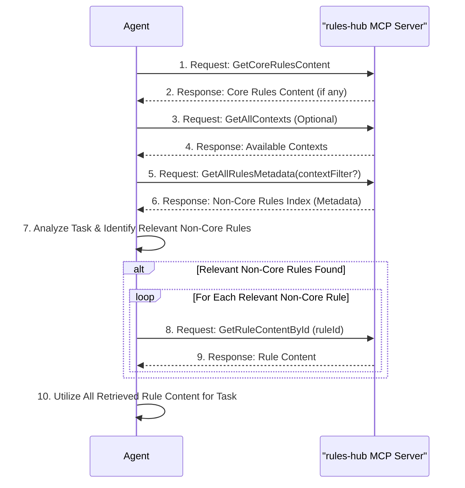

# ContextualAgentRulesHub

## Overview

**ContextualAgentRulesHub is an MCP (Model Context Protocol) server** that provides a flexible system for storing and retrieving agent rules that can be used by AI agents to follow context-specific guidelines. The MCP server exposes tools for efficient rule discovery and content retrieval, enabling AI agents to access only the rules relevant to their current task.

## Motivation

Managing agent rules effectively can be challenging. Sharing rules across different agents or projects often leads to inconsistencies and difficulties in maintaining a centralized rule set. Furthermore, AI agents often operate with limited context windows. Sending a large, undifferentiated set of rules can consume valuable context space. AgentRulesHub aims to address these issues by:

-   Providing a structured way to organize and access rules.
-   Enabling agents to retrieve only the rules relevant to their current task, thus minimizing context length and improving efficiency.
-   Supporting context-based rule organization for project-specific guidelines.

## Key Features

- **Context-Based Rule Organization**: Rules can be associated with specific contexts (e.g., project names), allowing for both general and context-specific guidelines
- **Multi-Source Support**: Extensible architecture supporting File, Database, Git Repository, and API sources
- **YAML-Based Storage**: Human-readable rule storage with metadata and content separation
- **Efficient Indexing**: Fast lookups by language, tags, context, and content search
- **Lazy Loading**: Rule content is loaded only when needed for optimal performance
- **Flexible Querying**: Support for complex queries combining language, tags, context, and text search
- **Tag-Based Organization**: Flexible categorization system with AND/OR logic support
- **Core Rules**: Support for `is_core` flag to identify essential rules, with a dedicated MCP tool (`GetCoreRulesContent`) to retrieve their content.

## Task Flow

This section describes the typical flow of an AI agent interacting with the AgentRulesHub MCP server to retrieve and utilize rules for a given task.

1.  **Task Initiation**: An agent (e.g., Cline) begins a new task with an optional context (e.g., "TheProject" for a specific project).
2.  **Retrieve Core Rules Content**: The agent queries the `GetCoreRulesContent` tool. If any core rules exist, their content is retrieved and applied as foundational guidelines for the task.
3.  **Retrieve Available Contexts** (Optional): The agent can query the `GetAllContexts` tool to discover available contexts for more specific rules.
4.  **Retrieve Rule Index**: The agent queries the `rules-hub` MCP server using the `GetAllRulesMetadata` tool, optionally providing a context filter. This provides an index of all *non-core* rules, including their IDs, descriptions, languages, tags, and contexts.
5.  **Identify Relevant Non-Core Rules**: Based on the current task's context (e.g., programming language, keywords, objectives) and the metadata received, the agent analyzes the rule index to identify which non-core rules are relevant.
6.  **Retrieve Non-Core Rule Content**: If relevant non-core rules are identified, the agent uses the `GetRuleContentById` tool for each relevant rule ID to fetch its specific content.
7.  **Utilize Rules**: The agent incorporates the content of all retrieved rules (core and non-core) to guide its actions, improve its output, or ensure adherence to specific guidelines for the task at hand.



## Context-Based Rule Filtering

The context feature allows you to organize rules for specific projects or domains while maintaining a set of general rules that apply universally.

### Context Behavior

- **No context filter**: Returns only rules without context (general rules)
- **With context filter**: Returns rules with no context OR rules matching the provided context

This ensures that general rules are always available, while context-specific rules are only returned when explicitly requested.

### Example Use Cases

1. **General Development**: No context filter - get all general coding standards
2. **Project-Specific Work**: Context filter "TheProject" - get general rules plus TheProject-specific guidelines
3. **MCP Server Development**: Context filter "mcp-server" - get general rules plus MCP-specific standards

## Installation

1. **Clone the repository**:
   ```bash
   git clone <repository-url>
   cd ContextualAgentRulesHub
   ```

2. **Install dependencies**:
   ```bash
   pip install -r requirements.txt
   ```

## MCP Server Configuration

### Installation for MCP Usage

1. **Install Python dependencies**:
   ```bash
   pip install -r mcp-server/requirements.txt
   ```

2. **Configure your MCP client** (e.g., Claude Desktop, Cline):
   
   Add the following to your MCP settings file:
   
   **For Claude Desktop** (`claude_desktop_config.json`):
   ```json
   {
     "mcpServers": {
       "cotextual-agent-rules-hub": {
         "command": "python",
         "args": ["C:/path/to/ContextualAgentRulesHub/mcp-server/run_server.py"],
         "env": {
           "RulesLoaderOptions:0:SourceType": "YamlFile",
           "RulesLoaderOptions:0:Path": "C:/path/to/ContextualAgentRulesHub/rules"
         }
       }
     }
   }
   ```
   
   **For Cline VSCode Extension** (`settings.json`):
   ```json
   {
     "cline.mcpServers": {
       "cotextual-agent-rules-hub": {
         "command": "python",
         "args": ["C:/path/to/ContextualAgentRulesHub/mcp-server/run_server.py"]
       }
     }
   }
   ```

### Custom Instructions for MCP Client Configuration

As part of your MCP server configuration, you should add the following optimized custom instruction block that leverages the context and core rules features:

```
When starting a new task:
1. Always begin by using the cotextual-agent-rules-hub MCP server's GetCoreRulesContent tool to retrieve and apply any foundational core rules.
2. Next, use the GetAllContexts tool to discover available contexts for more specific guidelines.
3. Unless the task explicitly states which context to use, ask the user to select from the available contexts or indicate that none should be used for non-core rules.
4. Use GetAllRulesMetadata with the appropriate contextFilter if the user selected a specific context, or without a filter for general non-core tasks.
5. Review the non-core rules metadata and identify ALL rules relevant to your task based on language, tags, and descriptions.
6. Use GetRuleContentById to retrieve the content of ALL relevant non-core rules.
7. Apply all retrieved rules (core and non-core) throughout your work on the task.

This approach ensures you always have access to fundamental core guidelines, general best practices, and project-specific rules when explicitly requested.
```

### Environment Configuration

The MCP server can be configured using environment variables:

| Variable | Description | Default |
|----------|-------------|---------|
| `RulesLoaderOptions:0:SourceType` | Source type for rules loading | `YamlFile` |
| `RulesLoaderOptions:0:Path` | Path to rules directory | `./rules` |
| `AGENT_RULES_VALIDATION` | Enable rule validation | `true` |
| `AGENT_RULES_LOG_LEVEL` | Logging level (DEBUG, INFO, WARNING, ERROR) | `INFO` |

#### Multiple Sources Configuration

You can configure multiple rule sources by using indexed environment variables. Add additional sources using `RulesLoaderOptions:1:`, `RulesLoaderOptions:2:`, etc.

**Example with multiple sources**:
```bash
# First source - Local YAML files
RulesLoaderOptions:0:SourceType=YamlFile
RulesLoaderOptions:0:Path=C:/path/to/ContextualAgentRulesHub/rules

# Second source - Additional rule directory
RulesLoaderOptions:1:SourceType=YamlFile
RulesLoaderOptions:1:Path=C:/path/to/additional/rules

# Third source - Team shared rules
RulesLoaderOptions:2:SourceType=YamlFile
RulesLoaderOptions:2:Path=\\shared\network\path\team-rules
```

**In MCP client configuration**:
```json
{
  "mcpServers": {
    "cotextual-agent-rules-hub": {
      "command": "python",
      "args": ["C:/path/to/ContextualAgentRulesHub/mcp-server/run_server.py"],
      "env": {
        "RulesLoaderOptions:0:SourceType": "YamlFile",
        "RulesLoaderOptions:0:Path": "C:/path/to/ContextualAgentRulesHub/rules",
        "RulesLoaderOptions:1:SourceType": "YamlFile",
        "RulesLoaderOptions:1:Path": "C:/path/to/additional/rules"
      }
    }
  }
}
```

### Available MCP Tools

The server exposes the following main tools:

#### `GetCoreRulesContent`
- **Purpose**: Retrieve content for all rules marked as `is_core: true`.
- **Parameters**: None
- **Returns**: JSON array of strings, where each string is the content of a core rule.
- **Usage**: Query this at the start of a task to get foundational guidelines.

**Example Response**:
```json
[
  "Core Rule 1 Content...",
  "Core Rule 2 Content..."
]
```

#### `GetAllContexts`
- **Purpose**: Retrieve all available contexts in the system for non-core rules.
- **Parameters**: None
- **Returns**: JSON array of context strings.
- **Usage**: Query this to discover available contexts for filtering non-core rules.

**Example Response**:
```json
[
  "TheProject",
  "mcp-server",
  "frontend-app"
]
```

#### `GetAllRulesMetadata`
- **Purpose**: Retrieve metadata for all available *non-core* rules.
- **Parameters**: 
  - `contextFilter` (optional): Filter non-core rules by context.
- **Returns**: JSON array of rule metadata objects.
- **Usage**: Query this to discover available non-core rules, optionally filtered by context. Core rules are excluded.

**Example Response**:
```json
[
  {
    "ruleId": "csharp-standards-rule",
    "description": "This rule checks for adherence to C# coding standards (non-core)",
    "language": "csharp",
    "tags": ["coding-standards", "best-practices"],
    "context": null,
    "source": {
      "sourceType": "File"
    }
  },
  {
    "ruleId": "theproject-python-guidelines",
    "description": "Python guidelines specific to TheProject (non-core)",
    "language": "python",
    "tags": ["python", "theproject"],
    "context": "TheProject",
    "source": {
      "sourceType": "File"
    }
  }
]
```

#### `GetRuleContentById`
- **Purpose**: Get the full content of a specific rule (core or non-core).
- **Parameters**: 
  - `ruleId` (string): The unique identifier of the rule.
- **Returns**: Rule content as markdown/text.
- **Usage**: Retrieve specific rule content after identifying relevant rules from metadata or if you know the ID of a core rule.

**Example Usage**:
```json
{
  "ruleId": "csharp-standards-rule"
}
```

#### Troubleshooting

- **Server won't start**: Check Python path and dependencies
- **No rules loaded**: Verify the `RulesLoaderOptions:0:Path` points to your rules directory
- **Permission errors**: Ensure the Python process has read access to the rules directory
- **Connection issues**: Check MCP client configuration and server logs
- **Context filtering not working**: Ensure rules have the `context` field properly set in YAML files

## Rule Format

### Rule Content File (`rules/python-pep8-standards.yaml`)

```yaml
id: python-pep8-standards
description: "Python PEP8 coding standards and formatting guidelines"
language: python
context: null  # Optional: null for general rules, or specify a context like "TheProject"
is_core: false # Optional: true if this is a core rule, defaults to false.
               # 'coreRule' is also supported for backward compatibility.
tags:
  - coding-standards
  - pep8
  - formatting
  - best-practices
rule: |
  # Python PEP8 Standards Guide
  
  ## Indentation
  - Use 4 spaces per indentation level
  - Never mix tabs and spaces
  
  ## Line Length
  - Limit all lines to a maximum of 79 characters
  
  [... detailed rule content ...]
```

### Context-Specific Rule Example

```yaml
id: theproject-api-guidelines
description: "API development guidelines specific to TheProject"
language: python
context: TheProject  # This rule only appears when context filter is "TheProject"
tags:
  - api
  - theproject
  - rest
  - guidelines
rule: |
  # TheProject API Development Guidelines
  
  ## API Versioning
  - All APIs must use semantic versioning
  - Version must be included in URL path: /api/v1/
  
  [... TheProject-specific guidelines ...]
```

## Extending the System

### Adding New Source Types

1. **Implement the RuleSource interface**:
   ```python
   from src.sources.base import RuleSource
   
   class CustomSource(RuleSource):
       def load_rules_metadata(self) -> List[Rule]:
           # Implementation
           pass
       
       def load_rule_content(self, rule_id: str) -> str:
           # Implementation
           pass
       
       def validate_source(self) -> bool:
           # Implementation
           pass
   ```

2. **Register with the repository**:
   ```python
   custom_source = CustomSource(config)
   repository.add_source(custom_source)
   ```
   
## Requirements

- Python 3.8+
- PyYAML 6.0+
- fastmcp (for MCP server)

## Implementation Status

✅ **Completed Features:**
- **MCP Server Implementation**: Fully functional FastMCP server with three tools
- **Context-Based Filtering**: Support for project-specific rule organization
- **Agent Rule System**: Complete rule management with lazy loading
- **YAML File Support**: Load rules from YAML files with metadata
- **Bootstrap System**: Environment-based configuration and initialization
- **Rule Repository**: In-memory storage with efficient querying
- **Content Sources**: Pluggable architecture for different source types
- **Integration Layer**: Bridge between MCP server and rule system
- **Testing Scripts**: Automated testing and validation
- **Comprehensive Documentation**: Setup, configuration, and usage guides

✅ **MCP Tools Available:**
- `GetAllContexts`: Discover available contexts
- `GetAllRulesMetadata`: Retrieve rule index for discovery with optional context filtering (excludes core rules).
- `GetRuleContentById`: Get specific rule content by ID.
- `GetCoreRulesContent`: Retrieve content for all rules marked as `is_core: true`.

### Managing Custom Instructions

The ContextualAgentRulesHub can also be effectively used as a centralized system for managing and distributing custom instructions for AI agents. By defining custom instructions as rules (potentially marked with `is_core: true` if they are fundamental), agents can dynamically fetch and apply the latest instructions relevant to their tasks or contexts. This approach offers several advantages:

- **Centralized Management**: Update instructions in one place, and all agents receive the updates.
- **Context-Specificity**: Provide different sets of custom instructions based on project, user, or task type.
- **Version Control**: If using a Git-backed source (future enhancement), instruction changes can be versioned.
- **Reduced Prompt Bloat**: Agents only load necessary instructions, saving context window space.

This turns the rule hub into a powerful "instruction bank" for your AI agents.

🔄 **Future Enhancements:**
- Database source implementation
- Git repository source implementation  
- API source implementation
- Rule validation enhancements
- Performance optimization for large rule sets
- Advanced querying capabilities
- Rule versioning system
- Rule inheritance and composition

## Contributing

1. Follow Python PEP8 standards (see included rule for details)
2. Add tests for new functionality
3. Update documentation for API changes
4. Use descriptive commit messages

## License

[License information to be added]
